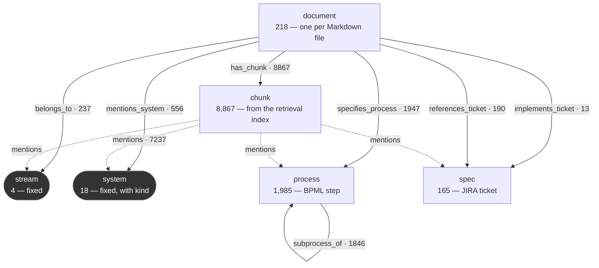

# Entity–Relationship Map — Solvay SPARK Knowledge Graph

Built from `knowledge_graph.py` (the extraction rules) and `knowledge_graph.json`
(the built graph): **2,390 entity nodes and 4,789 relationships**, plus a passage layer
of 8,867 chunks — 11,257 nodes and 20,893 relationships as a Neo4j property graph.

Regenerate the graph with `POST /api/graph/rebuild`, or in Python:

```python
import knowledge_graph
knowledge_graph.extract_graph(force=True)
```

---

## 1. Entity types

| Type | Id prefix | Count | What it represents | Example |
|---|---|---|---|---|
| `stream` | `stream:` | 4 | A top-level business value chain. Fixed list. | `stream:L2C` — Lead to Cash (48 connections) |
| `system` | `system:` | 18 | An IT platform. Fixed list. | `system:S4HANA` — SAP S/4HANA (40) |
| `document` | `doc:` | 83 | One converted Markdown file | `doc:20251031_…CMIR & Master Data_docx.md` (33) |
| `process` | `proc:` | 202 | A BPML process, or an L4 step from the register | `proc:4.10.2.1` — Process Consignment Return |
| `spec` | `spec:` | 47 | A JIRA ticket / functional specification | `spec:SPARK-22234` — the SOVOS interface |

Property sets differ by type. Documents carry `filename`, `source`, `format` and
`chars`; processes carry `code`, **`in_bpml`** and — for the 111 Lead-to-Cash L4
steps — **`jira_key`**; specs carry `ticket` and
`is_primary`. Every node carries `degree`, `size` and `color`.

---

## 2. The fixed vocabulary

**These ten hubs are hard-coded in `STREAMS` and `SYSTEMS` — they are not discovered
from the corpus.** A platform that is not on this list gets no node, however often the
documents name it.

### Streams (4)

| Code | Label | Covers | Documents |
|---|---|---|---|
| L2C | Lead to Cash | Sales order management, pricing, billing, logistics, collections | 48 |
| R2R | Record to Report | Financial accounting, commissions, general ledger, reporting | 11 |
| I2D | Idea to Delivery | Transit times, shipping, warehouse operations, physical delivery | 9 |
| P2P | Procure to Pay | Procurement, vendor purchase orders, goods receipt, invoice verification | 2 |

### Systems (6)

| Code | Label | Role | Documents |
|---|---|---|---|
| S4HANA | SAP S/4HANA | Target ERP — sales, billing, master data, central finance | 40 |
| ECC | SAP ECC | Legacy ERP being migrated under SPARK | 25 |
| Fiori | SAP Fiori | Role-based UX for custom enhancements | 28 |
| eCommerce | Solvay@eCommerce | Customer ordering portal, catalogue, invoice visibility | 10 |
| Salesforce | Salesforce (CRM) | Complaints, accounts, order intake | 4 |
| SOVOS | SOVOS (Tax Engine) | Tax determination and electronic compliance | 2 |

---

## 3. Relationships

Two layers, stored in one file. The **entity layer** (`nodes`, `edges`) holds 2,390
nodes and 4,789 relationships of 6 types. The **passage layer** (`passages`) holds
8,867 chunks and the relationships that tie them to documents and entities. The
match target is the document body plus its filename, with underscores opened into
spaces.

| Relation | Source | Target | Count | Rule that creates it |
|---|---|---|---|---|
| `belongs_to` | document | stream | 237 | `\bL2C\b` / `\bI2D\b` / `\bR2R\b` / `\bP2P\b` matches |
| `mentions_system` | document | system | 556 | the system's pattern matches (`SYSTEM_RE`) |
| `specifies_process` | document | process | 1,947 | `CODE_RE` in the **body only** |
| `subprocess_of` | process | process | 1,846 | **Not matched — looked up** in the BPML hierarchy. See below. |
| `implements_ticket` | document | spec | 13 | `\bSPARK[-_ ]?(\d{4,6})\b` matches **and** the number is in the filename |
| `references_ticket` | document | spec | 190 | Same match, but the number is **not** in the filename |
| `has_chunk` | document | chunk | 8,867 | every chunk the retrieval index holds for the document |
| `mentions` | chunk | stream / system / process / spec | 7,237 | the same patterns, run per chunk, kept only where the document is linked to the entity |

**One relationship type per meaning.** Document → system links used to come in six
types (`runs_on`, `interacts_with`, `integrates_with`, `interfaces_with`, `uses_ui`,
`connects_to`), chosen by *which system* was named rather than by anything the
document said. The extractor only knows that a document names a system, so there is
now one type, `mentions_system`, and what kind of system it is lives on the node:
`kind` is `sap`, `legacy_erp`, `crm`, `middleware`, `sap_ui`, `portal` or
`third_party`.

**Relationships carry their evidence.** Every relationship out of a document has:

| Property | Meaning |
|---|---|
| `method` | the rule that made it: `name_match`, `code_match`, `ticket_match`, `ticket_in_filename` (`subprocess_of` carries `bpml_hierarchy`) |
| `mentions` | how many times the document names the target |
| `chunk_count` | how many of its chunks name the target |
| `chunks` | the first five of those chunk keys (`PKG:10003882`), the ids retrieval uses — open one with `get_chunk` or `rag.chunk()` |
| `in_filename_only` | present when only the filename names the target |

**The passage layer** follows the usual graph-RAG pattern
`(:Document)-[:HAS_CHUNK]->(:Chunk)-[:MENTIONS {count}]->(entity)`. Chunk nodes are
read from the retrieval index, not re-chunked, so a chunk's `chunk_key` is exactly
the id the agents cite. It is stored compactly (each chunk lists its document and
its mentions) and expanded into relationships by `knowledge_graph.property_graph()`,
which the Neo4j exporters use. It sits beside the entity layer rather than in it, so
neighbourhoods, paths and the canvas stay about entities rather than passages. The
graph is rebuilt when the index is re-indexed, because chunk ids change then.

**Presentation is not stored.** `degree`, `size` and `color` are added when the graph
is loaded (`knowledge_graph.decorate`). Degree is derived from the relationships, and
the display radius used to overwrite the document's file size, which is now stored
as `bytes`.

### Read vs. derived

Every relationship out of a document is **read**: a pattern matched text, and its
`chunks` property says where, so you can go and see it in the source.

`subprocess_of` is **derived**. No document states it; it comes from the BPML
process house document, `knowledge_base/BPML_Process_xlsx.md`
(`bpml_markdown.hierarchy()`): a numbered process sits under the last numbered
segment of its path, a lettered code under the process that performs it as a task.
Each code is looked up, linked to its real parent, and the chain is walked to the top:

```
O-030-010 Identify Order → 4.5.2.4 Validate/Perform Order Readiness
                         → 4.5.2 Order Fulfillment
                         → 4.5   Manage Sales Orders
                         → 4.0   Lead to Cash
```

This is why process ids mix two notations: the letter codes come from the documents,
the numbered ones from the workbook.

**`in_bpml` records whether the workbook confirms a process: 79 of 90 true, 11 false.**
The eleven (`DM-270-*`, `O-160-030`, `O-160-100`, `E-020-010`, `O-140-150`) are named in
documents but absent from the export, so they are kept and left **without a parent**
rather than given an invented one.

`implements_ticket` is partly derived too — the filename is evidence the body may not
repeat.

---

## 4. Schema diagram


Source: `kg-entity-relationships.puml`. Re-render after a rebuild with:

```bash
plantuml -tpng docs/kg-entity-relationships.puml
```

The same schema as Mermaid, for viewers that render it inline:



**Reading the diagram:** dark boxes are the hard-coded vocabulary; dashed arrows are the
passage layer. `subprocess_of` is the only self-loop.

---

## 5. Direction and shape

**The document is the hub.** Every stream, system, process and spec edge starts at a
document — all 560 edges have a `document` source except the 185 `subprocess_of` ones.
Nothing connects a stream to a system, or a spec to a process, directly.

The practical consequence: **two systems are only ever connected through a document
that names both.** If no single document mentions both, there is no two-hop route, and
anything longer runs through a stream hub — which is co-membership, not an integration.
Salesforce and SOVOS are exactly this case: their shortest route is four hops via
`stream:L2C`, and `backend/agents/evidence/paths.py` rejects it for that reason.

`subprocess_of` is the only relation joining two nodes of the same type, and the only
one that forms a chain rather than a star.

---

## Known disagreements between the code and the data

1. **`is_primary` on the node contradicts `implements_ticket` on the edge.** The JSON
   has 13 primary edges over 12 distinct tickets, but only **10** spec nodes are flagged
   `is_primary: true`. `add_node` keeps the first write, so a ticket first seen as an
   incidental reference keeps `false` even when a later document is its primary spec.
   `SPARK-21930` and `SPARK-21266` are both affected. **Trust the edge, not the node
   flag.**

2. **The module docstring lists `L-xxx-xxx` as a discovered code family.** No `L-`
   prefixed code exists in the graph; the actual prefixes are `O`, `DM`, `M`, `DC`, `E`,
   `P`, `X`, plus the numbered BPML codes.

3. **`kg_algorithm.html` is out of date.** It quotes 1,200 relationships (actual 560),
   S/4HANA at 68 connections (actual 40), and SOVOS touching 14 documents (actual 2).
