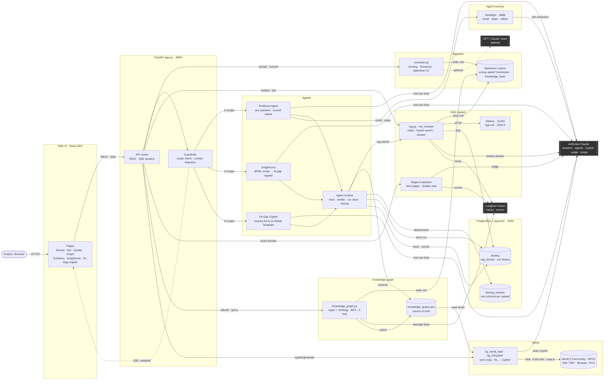

# System Architecture Diagram

This diagram shows Solvay Spark Spine AI's subsystems, the direction data flows between
them, and where data leaves the machine. Each subsystem is drawn on its own because each
has its own store and its own reason to exist:

| Subsystem | Code | Store | Job |
| --- | --- | --- | --- |
| **Ingestion** | `backend/ingestion/` | Markdown corpus on disk | Docling + OCR + CV turn decks, specs, sheets and mail into Markdown |
| **RAG system** | `backend/rag/` | PostgreSQL `rag_documents` / `rag_chunks` | Chunk, embed (Ollama `bge-m3`), hybrid vector + BM25 search, cited answers, Ragas scoring |
| **Knowledge graph** | `backend/graph/knowledge_graph.py` | `data/knowledge_graph.json` | Regex + ontology entities from the Markdown, plus a passage layer read from `rag_chunks`; BFS and 2-hop traversal |
| **Neo4j** | `backend/graph/kg_neo4j_load.py`, `kg_nl2cypher.py` | Neo4j 5 Community + APOC, Bolt `:7687`, Browser `:7474` | A read-only copy of the graph, loaded whole; Claude writes Cypher from plain English |
| **Agents** | `backend/agents/` | PostgreSQL run stores | Evidence Agent (any question → scored claims), InsightLens (a BPML scope → fit-gap register), Fit-Gap Copilot (a country As-Is → deviation register and workshop pack) — they reach RAG and the graph only through their tools |
| **Hindsight** | `backend/agents/fitgap/memory.py` (client) | Hindsight's embedded Postgres | Long-term agent memory: recall before a run, retain verified claims after |
| **PostgreSQL** | `rag.connection()`, `*/store.py` | `docling`, `docling_session` | The corpus index, every run's history, and isolated per-session uploads |
| **Langfuse** | `backend/core/tracing.py`, `evaluation.py`, `agent_eval.py` | Langfuse Cloud | One trace per run, and every quality score |

For the step-by-step processing detail see [`pipeline.md`](pipeline.md); for memory see
[`agent-memory.md`](agent-memory.md); for Cypher see [`neo4j.md`](neo4j.md); for tracing and
scores see [`tracing-and-evaluation.md`](tracing-and-evaluation.md).

## What the application does — the flows

[`system-workflow.png`](system-workflow.png) walks these in order; the
[live demo](demo/index.html) walks all of them except InsightLens:

1. **Upload and convert** — a document (deck, spec, sheet, PDF, e-mail) is converted to
   Markdown by Docling, with OCR and CV reading the pictures inside it.
2. **Chunk, embed, store** — heading-aware chunks, embedded locally by Ollama `bge-m3`,
   stored in PostgreSQL/pgvector with a full-text index beside the vectors.
3. **Build the knowledge graph** — from every Markdown file in the corpus plus the indexed
   chunks, saved as `knowledge_graph.json` and loaded into Neo4j.
4. **Ask RAG** — hybrid search over pgvector + BM25, the top chunks to Claude, a cited answer
   streamed back; then **Ragas** judges the answer and the scores land in Postgres and Langfuse.
5. **Evidence Agent** — one question investigated across RAG, the knowledge graph and
   Hindsight memory, answered as verified, scored claims.
6. **InsightLens** — a BPML scope classified step by step into a fit-gap register, with
   reuse %, decision pack and workshop agenda.
7. **Fit-Gap Copilot** — a country's As-Is document compared with the Global Template and
   SAP Best Practice, in two passes, into a deviation register, scores and a workshop pack.
8. **Explore in Neo4j** — a plain-English question turned into Cypher by Claude, checked,
   and run read-only on Neo4j Community.

Every flow is traced in Langfuse, and every run is kept in PostgreSQL.

## How the subsystems depend on each other

The build order is **Markdown → RAG index → graph → Neo4j**, and each arrow in it is a real
dependency, not a convention:

- The **RAG system** indexes the Markdown the ingestion pipeline wrote.
- The **knowledge graph** reads the same Markdown files *and* the `rag_chunks` table, so
  every relationship can cite the retrieval chunks that name it. Without the index the
  graph still builds, without its passage layer.
- **Neo4j** is loaded from `knowledge_graph.json` — whole, never edited in place — at
  start-up and after every graph rebuild. It serves the Cypher view and the graph Quality
  check. **The agents do not query Neo4j**; they traverse the JSON graph in-process.

At question time the two engines still never call each other. The **agents** are the only
place both meet: their tools wrap `rag.search()` and the in-process graph, and log every
chunk returned, which is what the verifier checks quotes against. **Hindsight** sits beside
the agents, not inside the evidence: a recalled note is not in that log, so it can orient a
run but never ground a claim, and only verified claims are retained. The Evidence Agent is
the one agent wired to it today; the others are to follow.

Every agent and Ask request passes the **guardrails** first (a scope check, with a Haiku
classifier for anything the domain signals do not settle), and every `/api/*` answer passes
a contact-detail redactor on the way out. **Langfuse** receives a trace from Ask, each agent
run, each upload, each NL→Cypher request and each graph check, plus the Ragas judge scores,
the agents' code-only scores and the graph quality scores.

## Diagram

**Reading the diagram:**

- Solid arrows = request/command direction; dashed = streamed or optional.
- Dark boxes = external services this app depends on but doesn't control, and the only
  places data leaves the machine for. Ollama, Neo4j, Hindsight and PostgreSQL all run
  locally on `127.0.0.1`; Hindsight's own model call does go to Claude.
- Cylinders = state: the Markdown corpus, the Postgres databases, the JSON graph and its
  Neo4j copy.
- `rag.py` and `knowledge_graph.py` never call each other. The graph reads the index's
  chunks at build time; the agents read both at question time.
